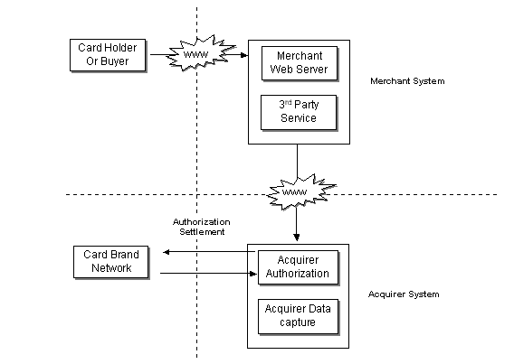



## Tutorial on ECommerce implementation: Learn how to implement ECommerce transactions using sockets\.

### Description

Well, I think that this one is the most

valuable and lengthy article ever posted to Planet-Source-Code. Anyway,

download this and decide it yourself. A very neatly designed HTML tutorial and three

full fledged projects are there. Just say bye to your uncertainty to internet in

general, and ECommerce in particular.

After reading this article, you can:

<ul>

<li>Get the basic concepts of making

ECommerce transactions from ASP/VB projects.</li>

<li>Get the concept of developing and

implementing COM (Component Object Model) DLLs (Dynamic Link Library) for

ASP applications.</li>

<li>Learn how to write socket based

servers</li>

<li>Learn how to use wrappers - in this

case, a socket wrapper for using windows sockets from ASP.</li>

<li>Get some killer logic to put in your

next project :-)</li>

</ul>

Don't get afraid even if you can't

understand anything from the description. Of course, I prepared the whole

article very plainly - sticking to the basics; and I am sure than any one with a

very basic knowledge of VB and ASP can follow this very easily. Thanks for

already making me a winner two-three times, and I expect it again from you. Because, I took nearly 9-10 hours to design and develop the whole thing.

Also, visit my website http://www.geocities.com/anoopj12

, when you have time. Regards, Anoop 

 
### More Info
 

             |
---                |---
**Submitted On**   |2000-12-14 00:04:46
**By**             |[Anoop Madhusudanan](https://github.com/Planet-Source-Code/PSCIndex/blob/master/ByAuthor/anoop-madhusudanan.md)
**Level**          |Intermediate
**User Rating**    |4.6 (64 globes from 14 users)
**Compatibility**  |VB 6\.0, VB Script, ASP \(Active Server Pages\) 
**Category**       |[Complete Applications](https://github.com/Planet-Source-Code/PSCIndex/blob/master/ByCategory/complete-applications__1-27.md)
**World**          |[Visual Basic](https://github.com/Planet-Source-Code/PSCIndex/blob/master/ByWorld/visual-basic.md)
**Archive File**   |[CODE\_UPLOAD1267612142000\.zip](https://github.com/Planet-Source-Code/anoop-madhusudanan-tutorial-on-ecommerce-implementation-learn-how-to-implement-ecommerce-t__1-13586/archive/master.zip)

### Source Code

Kindly download the Zip file, by clicking the link below, to see the article and the associated projects (3 projects) in it. Extract the Zip, and read the Readme Text File First.

